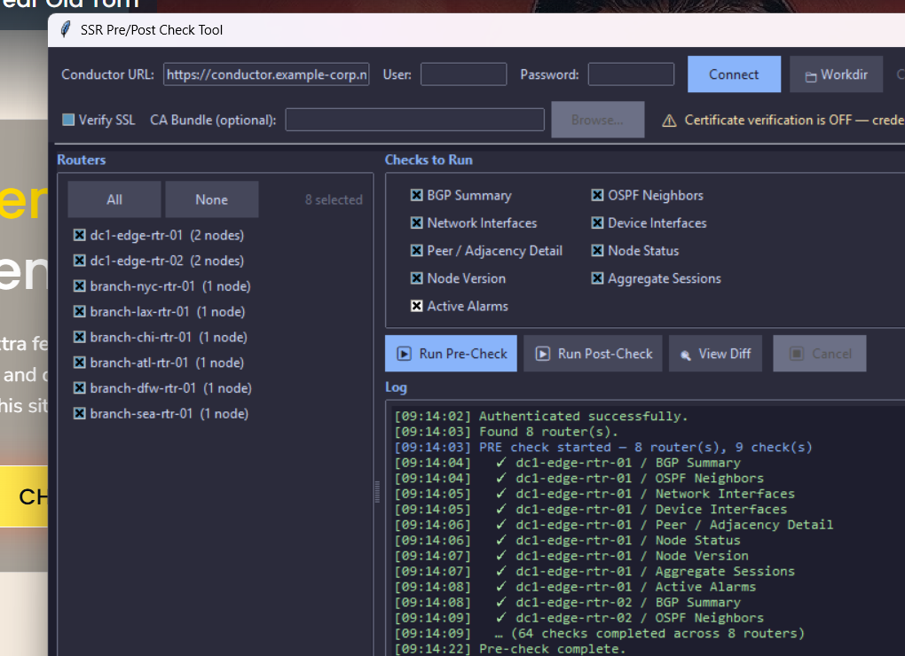
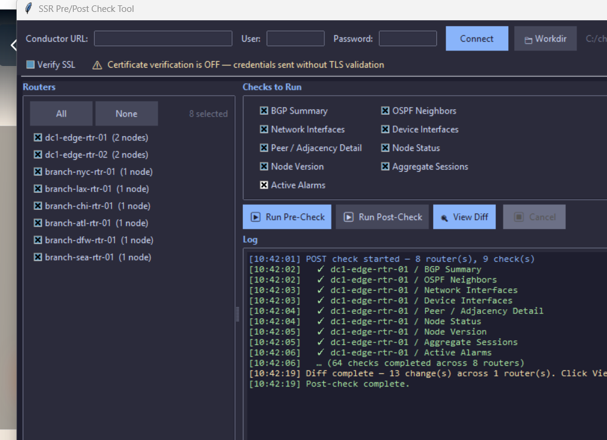
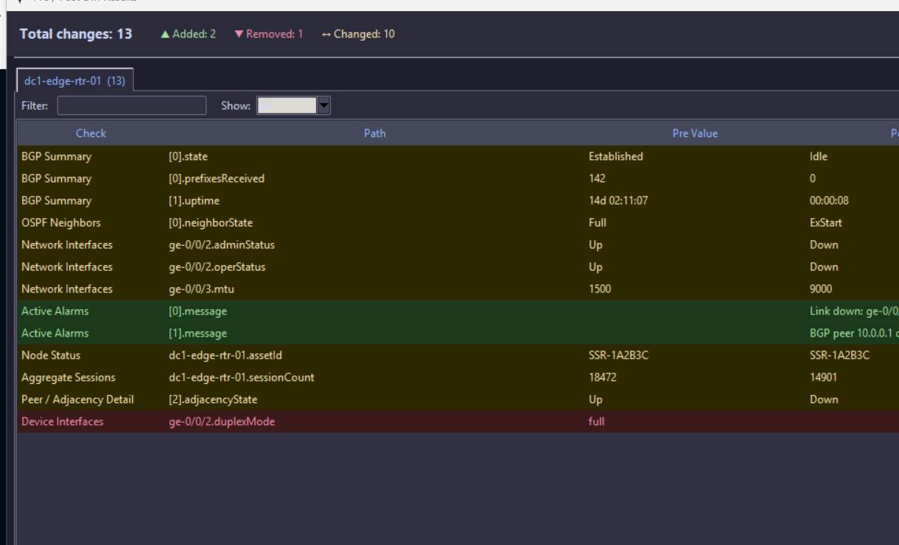
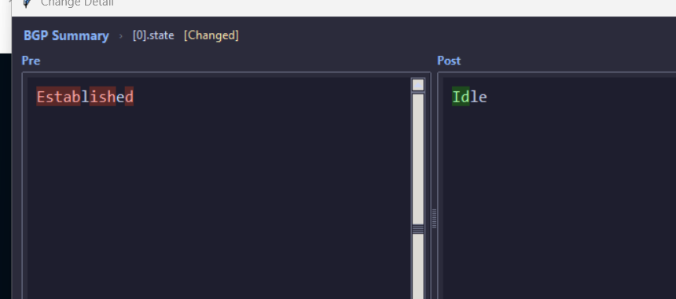

# SSR Pre/Post Check Tool

A desktop GUI application for **Juniper Session Smart Router (SSR)** network engineers to capture and compare device state before and after a maintenance change. Connects directly to the **Juniper Conductor** REST API.

  

---

## Screenshots

| Main Window (Connected) | Post-Check Log |
|---|---|
|  |  |

| Diff Viewer | Character-Level Detail |
|---|---|
|  |  |

---

## What It Does

Network changes carry risk. This tool reduces that risk by:

1. **Pre-check** — Connect to Conductor, select your routers, run all checks, and save a JSON snapshot of current device state.
2. Make your change.
3. **Post-check** — Run the same checks again. The tool automatically loads the matching pre-check snapshots and computes a field-by-field diff.
4. **Review** — A color-coded GUI shows every Added, Removed, or Changed value across all routers. Double-click any row for a character-level side-by-side diff.
5. **Export** — Save the full diff to CSV for change records or tickets.

---

## Checks Performed

| Check | API Endpoint |
|---|---|
| BGP Summary | `GET /api/v1/router/{r}/bgp?command=summary` |
| OSPF Neighbors | `GET /api/v1/router/{r}/ospf?command=neighbor` |
| Network Interfaces | `GET /api/v1/router/{r}/node/{n}/networkInterface` |
| Device Interfaces | `GET /api/v1/router/{r}/node/{n}/deviceInterface` |
| Peer / Adjacency Detail | `GET /api/v1/router/{r}/node/{n}/adjacency` |
| Node Status | `GET /api/v1/router/{r}/node/{n}/status` |
| Node Version | `GET /api/v1/router/{r}/node/{n}/version` |
| Aggregate Sessions | `POST /api/v1/router/{r}/stats/aggregate-session/node/session-count` |
| Active Alarms | `GET /api/v1/router/{r}/alarm` |

All checks can be individually enabled/disabled per run.

---

## Requirements

- Python 3.8+
- `requests` library

```bash
pip install requests
```

`tkinter` is included in the standard Python distribution on all platforms. On some Linux systems you may need:

```bash
sudo apt install python3-tk   # Debian/Ubuntu
sudo dnf install python3-tkinter  # Fedora/RHEL
```

---

## Usage

```bash
python ssr-pre-post-gui.py
```

Optional flag:

```bash
python ssr-pre-post-gui.py --debug
```

`--debug` enables verbose output in the log pane, including saved file paths for each JSON snapshot.

### Workflow

1. **Connect** — Enter your Conductor URL (e.g. `https://conductor.example.com`), username, and password. Click **Connect**. The tool authenticates, then auto-discovers all routers and nodes.

2. **SSL** — By default TLS certificate verification is disabled (common for lab/self-signed environments). Enable **Verify SSL** and optionally provide a CA bundle for production use.

3. **Select routers** — Use the left panel to select which routers to include. **All / None** shortcuts are provided.

4. **Select checks** — Tick or untick individual checks in the right panel.

5. **Working directory** — Click **📁 Workdir** to choose where JSON snapshots are saved. Defaults to the current directory.

6. **Run Pre-Check** — Click **▶ Run Pre-Check** before your change. Each check result is saved as:
   ```
   <router>-pre-<check>-<YYYYMMDD-HHMM>.json
   ```

7. Make your change.

8. **Run Post-Check** — Click **▶ Run Post-Check** after your change. Results are saved as `post` files. The diff is computed automatically.

9. **View Diff** — Click **🔍 View Diff** to open the diff viewer. Filter by text or change type (Added / Removed / Changed). Double-click any row for a character-level side-by-side comparison.

10. **Export CSV** — Save the complete diff for documentation.

---

## Architecture

```
ssr-pre-post-gui.py
│
├── API layer
│   ├── authenticate()      POST /api/v1/login → Bearer token
│   ├── rest_get()          Authenticated GET
│   └── rest_post()         Authenticated POST
│
├── Check engine
│   ├── CHECKS dict         Registry of all check keys, labels, endpoint templates
│   └── collect_check()     Dispatches router_get / router_post / node_get per check type
│
├── Diff engine
│   ├── flatten()           Recursively flattens JSON → {dotted.key: str_value}
│   ├── compute_changes()   Set diff of pre/post flattened dicts → Added/Removed/Changed rows
│   └── char_diff()         difflib SequenceMatcher → character-level segment pairs
│
├── Background worker
│   └── worker()            Daemon thread; communicates progress via Queue
│
└── GUI (tkinter / ttk)
    ├── App                 Main window — connection, router list, check selection, log
    ├── DiffViewer          Summary bar + per-router tabs
    ├── RouterTab           Filterable, sortable Treeview of diff rows
    └── DetailDialog        Side-by-side character-level diff popup
```

---

## Security Notes

- **Password handling**: The password field is cleared from the UI immediately after a successful (or failed) authentication attempt. A best-effort CPython memory overwrite (`ctypes.memset`) is applied to the password string before garbage collection to reduce the plaintext window in memory.
- **TLS**: Production use should enable SSL verification. The tool warns visibly when verification is disabled.
- **Token scope**: The Bearer token is only used for read-only GET/POST-query operations against the Conductor API. No configuration changes are made.

---

## File Output

Each check run writes timestamped JSON files to the working directory:

```
conductor-router1-pre-bgp_summary-20250409-1430.json
conductor-router1-pre-ospf_neighbors-20250409-1430.json
...
conductor-router1-post-bgp_summary-20250409-1512.json
...
```

The post-check worker automatically finds the most recent matching pre-check file for each router/check combination.

---

## License

MIT
